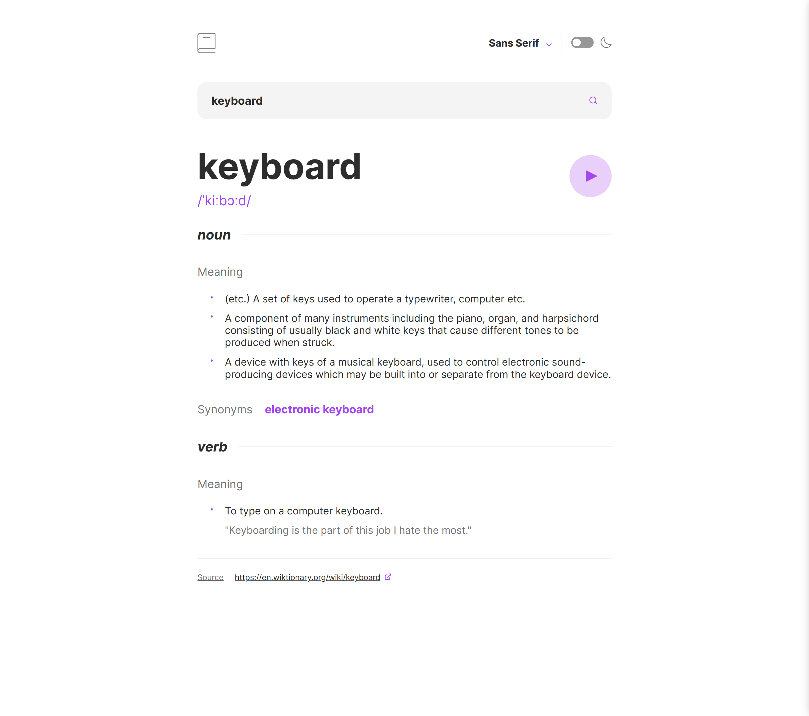
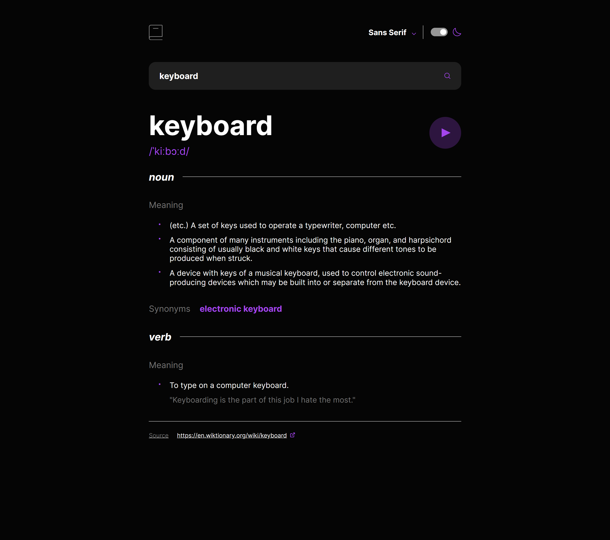
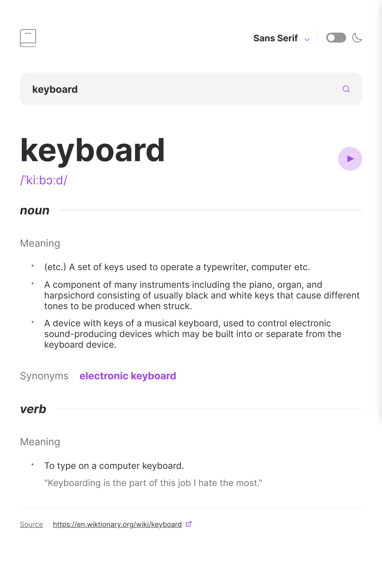
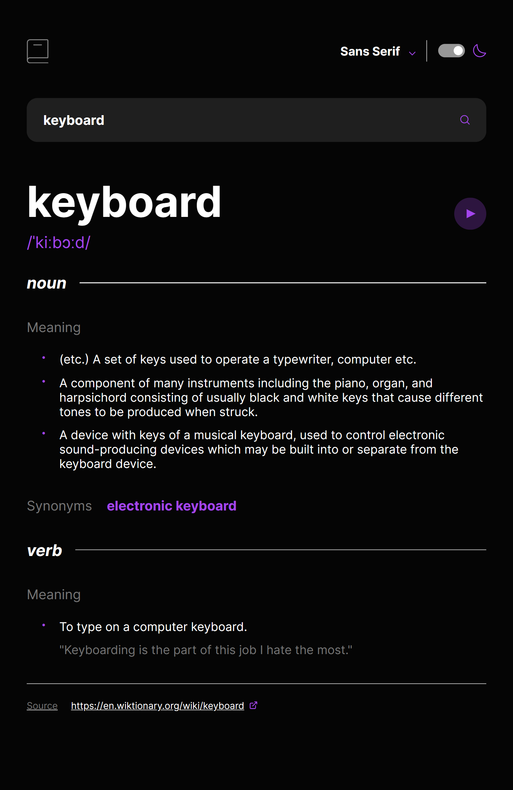
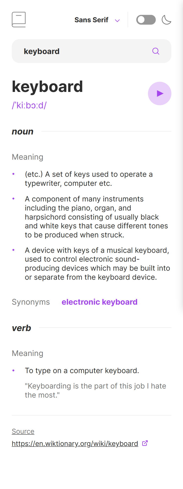
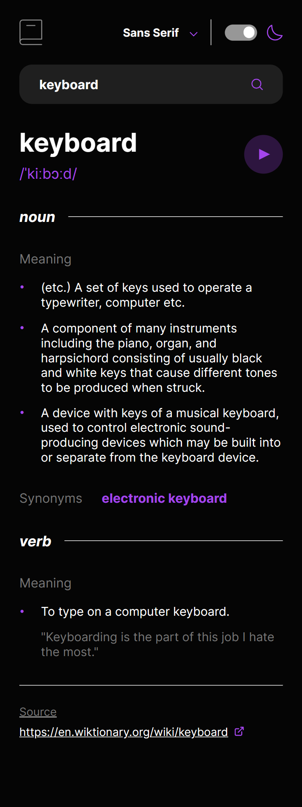
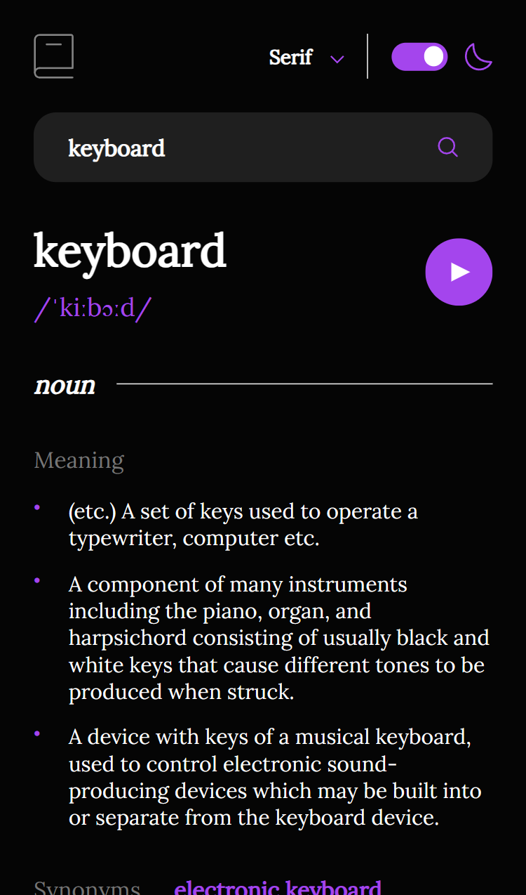
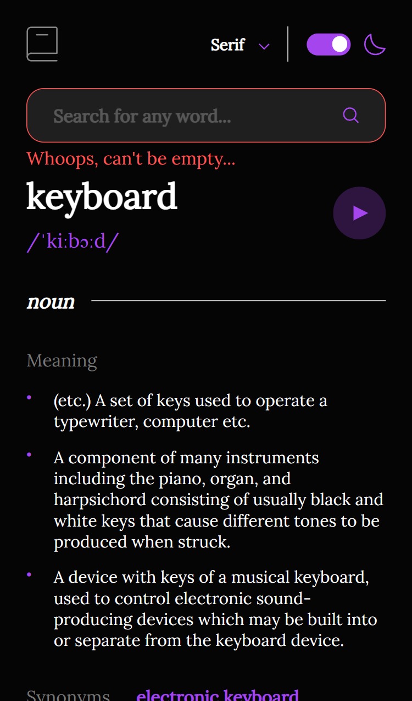
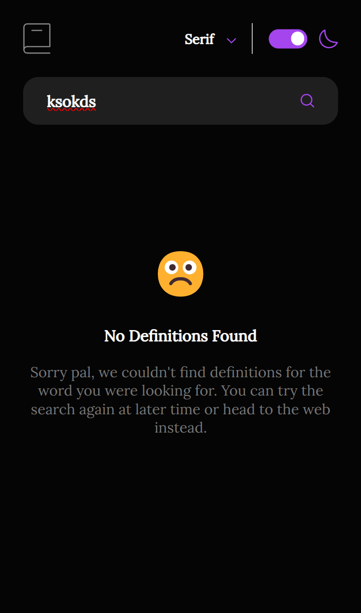
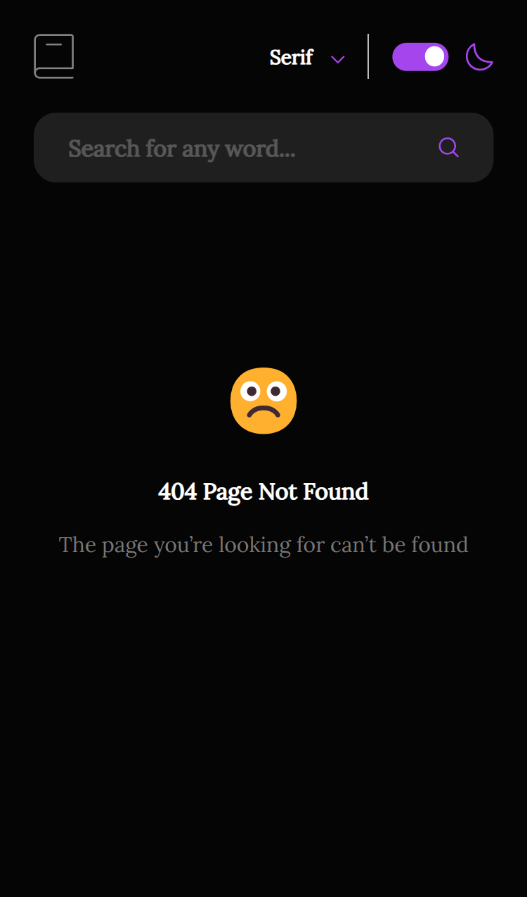

# Frontend Mentor - Dictionary web app solution



This is a solution to the [Dictionary web app challenge on Frontend Mentor](https://www.frontendmentor.io/challenges/dictionary-web-app-h5wwnyuKFL). Frontend Mentor challenges help you improve your coding skills by building realistic projects.

## Table of contents

- [Frontend Mentor - Dictionary web app solution](#frontend-mentor---dictionary-web-app-solution)
  - [Table of contents](#table-of-contents)
  - [Overview](#overview)
    - [The challenge](#the-challenge)
    - [Screenshot](#screenshot)
    - [Links](#links)
  - [My process](#my-process)
    - [Built with](#built-with)
    - [What I learned](#what-i-learned)
    - [Continued development](#continued-development)
    - [Useful resources](#useful-resources)
  - [Author](#author)
  - [Acknowledgments](#acknowledgments)

## Overview

### The challenge

Users should be able to:

- Search for words using the input field
- See the Free Dictionary API's response for the searched word
- See a form validation message when trying to submit a blank form
- Play the audio file for a word when it's available
- Switch between serif, sans serif, and monospace fonts
- Switch between light and dark themes
- View the optimal layout for the interface depending on their device's screen size
- See hover and focus states for all interactive elements on the page
- **Bonus**: Have the correct color scheme chosen for them based on their computer preferences. _Hint_: Research `prefers-color-scheme` in CSS.

### Screenshot












### Links

- Solution URL: [GitHub](https://github.com/newbpydev/dictionary-angular-scss-app)
- Live Site URL: [Netlify](https://earnest-cactus-40f545.netlify.app/search/keyboard)

## My process

### Built with

- Angular 17
- Rxjs
- Semantic HTML5 markup
- SCSS custom properties
- Flexbox
- Mobile-first workflow
- [Angular](https://angular.io/) - Angular Framework
- [RxJS](https://rxjs.dev/) - Reactive Extensions Library for JavaScript
- [SCSS](https://sass-lang.com/) - CSS with superpowers

### What I learned

I approached this project by first understanding the requirements and breaking down the
tasks. Challenges included dealing with the Angular framework, implementing the HttpClient
for API calls, and managing components within and outside the router-outlet. Overcoming
these challenges was a valuable learning experience.

This project served as my introduction to Angular, where I learned about inline templates, styles, and keeping components in a single file. I gained insights into working with RxJS for shared data between components and handling routing complexities.

To see how you can add code snippets, see below:

```html
<div class="font-selection-wrapper">
  <button class="font-btn" (click)="toggleSelectMenu()" appClickOutside (clickOutside)="isSelecting && handleOutsideClick()">
    <span>{{ selectedFont | titlecase }}</span>
    <app-svg-icon icon="arrow-down" width="12" height="6" />
  </button>

  @if (isSelecting) {
  <ul class="font-options" [ngClass]="isDark ? 'dark' : ''">
    <li class="font-options__sans-serif" (click)="handleFontChange('sans serif')">Sans Serif</li>
    <li class="font-options__serif" (click)="handleFontChange('serif')">Serif</li>
    <li class="font-options__mono" (click)="handleFontChange('mono')">Mono</li>
  </ul>
  }
</div>
```

```css
.play {
  cursor: pointer;

  & circle {
    transition: all 0.3s ease-in-out;

    & + path {
      transition: all 0.3s ease-in-out;
    }

    &:hover {
      opacity: 1;

      & + path {
        fill: #fff;
      }
    }
  }
}
```

```js
@Injectable({
  providedIn: 'root',
})
export class StorageService {
  constructor(@Inject(PLATFORM_ID) private platformId: Object) {}

  isLocalStorageAvailable(): boolean {
    return isPlatformBrowser(this.platformId) && !!window.localStorage;
  }

  setItem(key: string, value: any): void {
    if (this.isLocalStorageAvailable()) {
      localStorage.setItem(key, JSON.stringify(value));
    }
  }

  getItem(key: string): any {
    if (this.isLocalStorageAvailable()) {
      const item = localStorage.getItem(key);
      return item ? JSON.parse(item) : null;
    }
  }

  removeItem(key: string): void {
    if (this.isLocalStorageAvailable()) {
      localStorage.removeItem(key);
    }
  }

  clear(): void {
    if (this.isLocalStorageAvailable()) {
      localStorage.clear();
    }
  }
}
};
```

### Continued development

In future updates, I plan to continue exploring more the vast world of Angular. From
Signals, defer directives and so much. In this project I decided to not use those tools
yet so I could experience what problems do these tools solve. I am very excited for whats
to come.

### Useful resources

- [Angular](https://angular.io/) - This helped me understand the ins and outs of Angular.
  It is the best source of information for Angular.
- [Angular Dev](https://angular.dev/) - This is the amazing new home of Angular Docs. The
  new format helped me get a quick grasp on many Angular topics such as Router, Forms, and
  Directives to name a few.

## Author

- Website - [Juan Gomez](https://github.com/newbpydev)
- Frontend Mentor - [@newbpydev](https://www.frontendmentor.io/profile/newbpydev)
- Twitter - [@Newb_PyDev](https://twitter.com/Newb_PyDev)

## Acknowledgments

The code may not be perfect compared to my sensei @jonasschmedtman but I need to thank him because he has shown me the ropes and now I am a confident web
designer.
